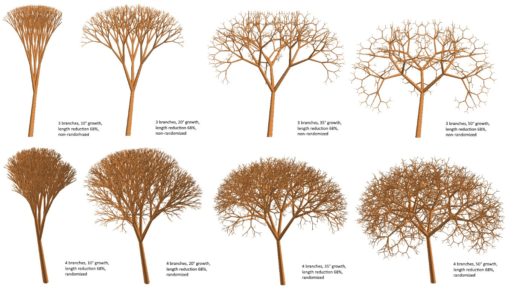

#3D fractal tree

this is a L-type fractal... in 3D. It features a trunk (inclinable) and branches (the real fractal). *Since it is pretty heavy (a lot of polygons) for the GDL engine, I recommend to use it with caution (can crash archicad)*

Branches growth angle can be adjusted in UI parameters.

Other parameters:
- size reduction of trunk/branches from base to top
- initial height and diameter of trunk/branches (branches sizes can be automatically determined from the trunk sizes)
- material
- resolution (dynamic too: reduces proportionally, up to 3 edges if branches are very thin)
- max recursion (default: 7) and min branch diameter.

